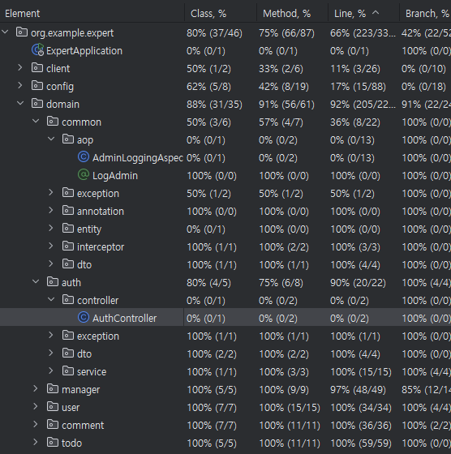

# SPRING ADVANCED

## 1. 프로젝트 개요 (Overview)

이 프로젝트는 Spring Boot 기반 백엔드 애플리케이션으로, 인증/인가, 사용자 관리, Todo 관리, 댓글 기능 등을 포함한 구조를 가지고 있다.
주어진 과제의 목표는 단순한 기능 구현이 아니라, 문제 분석 능력·코드 품질·테스트 작성 능력·N+1 최적화·로깅 설계 등을 종합적으로 평가하는 것이다.

본 프로젝트에서 해결해야 하는 주요 항목은 다음과 같다.

## 2. 핵심 목표

| 구분                        | 내용                                                   |
|---------------------------| ---------------------------------------------------- |
| **Lv 0. 프로젝트 세팅**         | 애플리케이션 실행 실패 원인을 분석하고 정상 실행되도록 수정                    |
| **Lv 1. ArgumentResolver** | AuthUserArgumentResolver 복구 및 ArgumentResolver 동작 구현 |
| **Lv 2. 코드 개선**           | Early Return, 불필요한 if 제거, Validation 개선 등 리팩토링       |
| **Lv 3. N+1 문제 해결**       | 기존 fetch join 방식 → EntityGraph 기반으로 대체               |
| **Lv 4. 테스트 코드 작성**       | 의도된 성공/실패 케이스 테스트 수정 및 서비스 코드 보완                     |
| **Lv 5. API 로깅 **         | Interceptor & AOP 기반의 로깅 구조 구현                       |
| **Lv 6. 문제 정의 및 해결 문서화 ** | 스스로 문제를 발굴해 해결 과정 문서화                                |
| **Lv 7. 테스트 커버리지 **       | 테스트 커버리지 향상 및 결과 이미지 첨부                              |

## 3. 기술스택
| 분야                  | 기술                                                                |
| ------------------- | ----------------------------------------------------------------- |
| **Backend**         | Spring Boot 3.5.x, Spring Web, Spring Data JPA, Spring Validation |
| **Language**        | Java 17                                                           |
| **Build Tool**      | Gradle                                                            |
| **Database**        | MySQL, H2(테스트용)                                                   |
| **Security / Auth** | JWT (jjwt), BCrypt                                                |
| **ORM**             | Hibernate(JPA 기본 포함)                                              |
| **Lombok**          | lombok                      |
| **Test**            | Spring Boot Starter Test, JUnit Platform, H2                      |
| **Repository**      | Maven Central                                                     |

## 4. 테스트 커버리지

